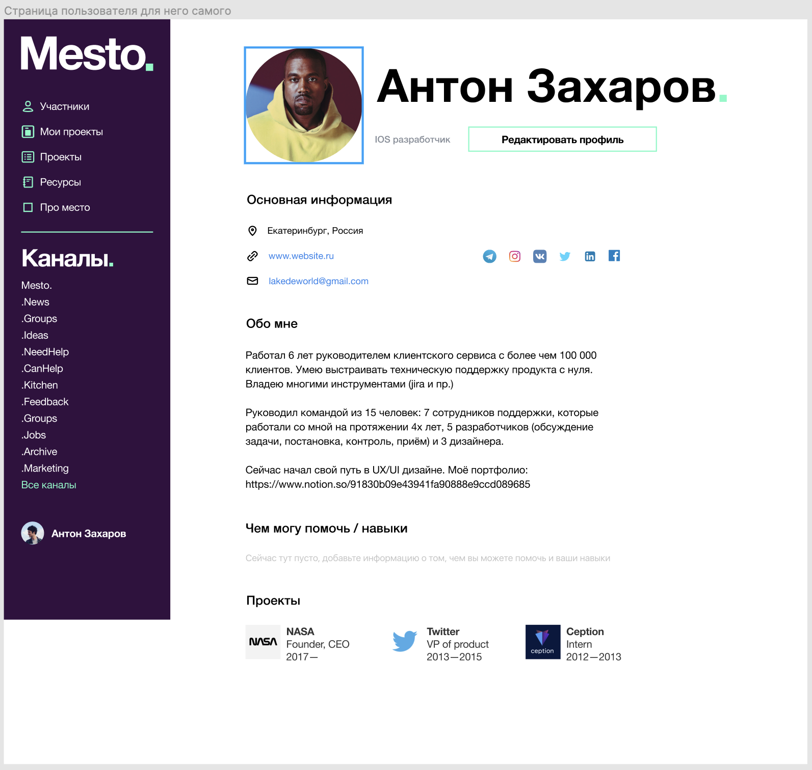

# Просмотр своего профиля
Я, как зарегистрированный пользователь, хочу иметь возможность просмотреть свой профиль.

## Сценарий
1. Пользователь переходит на экран профиля <https://mesto.co/profile> 
2. Происходит запрос API [Получение своего профиля](../../ApiDoc/User/SelfProfile.md)
3. На экране отоборажается профиль пользователя

# Просмотр чужого профиля
Я, как зарегистрированный пользователь, хочу иметь возможность просмотреть профиль других пользователей.

## Сценарий
1. Пользователь переходит из списка пользователей либо из поиска пользователей к профилю пользователя (например, <https://mesto.co/profile/:profileId>)
2. Происходит запрос API [Получения профиля пользователя](../../ApiDoc/User/User.md)
3. На экране отображение профиля пользователя

# Экранная форма

