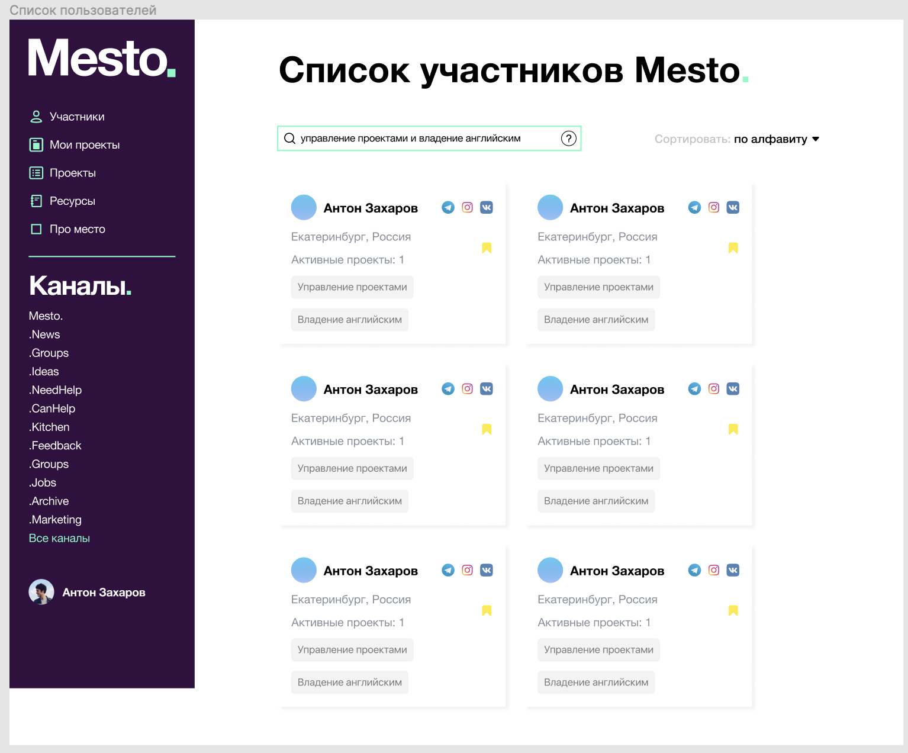

# Список пользователей
Я, как зарегистрированный пользователь хочу увидеть список пользователей на странице "Участники"

## Сценарий
1. Пользователь переходит через боковое меню к экрану "Участники"
2. Происходит запрос сервиса [Поиск участников](../../ApiDoc/User/FindUser.md) с поисковым запросом " "
3. Результат выполнения запроса отображется на экране.
4. Пользователь может ввести свой поисковый запрос.В данном случае происходит запрос сервиса [Поиск участников](../../ApiDoc/User/FindUser.md) с поисковым запросом, введенным в поисковой строке. Должен быть реализован итеративный поиск после ввода 3-го символа, либо с задержкой на запрос 1-2 секунды.
5. Вывод результатов происходит постравнично, посредствам технологии InfinityScroll

## Экранная форма

