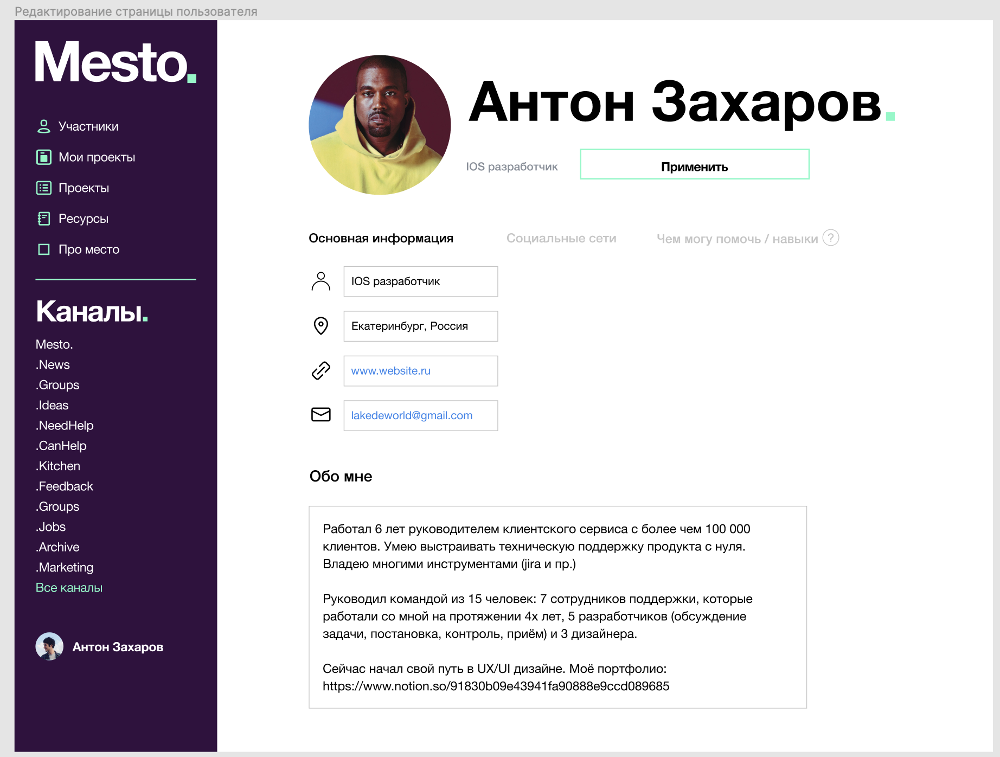
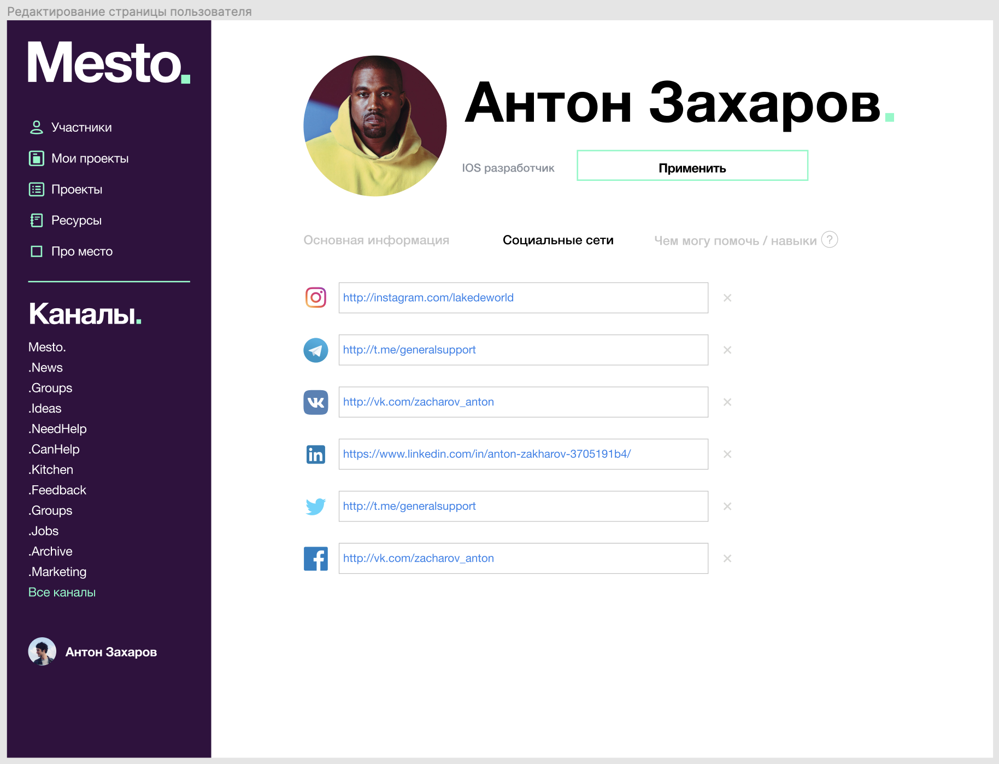
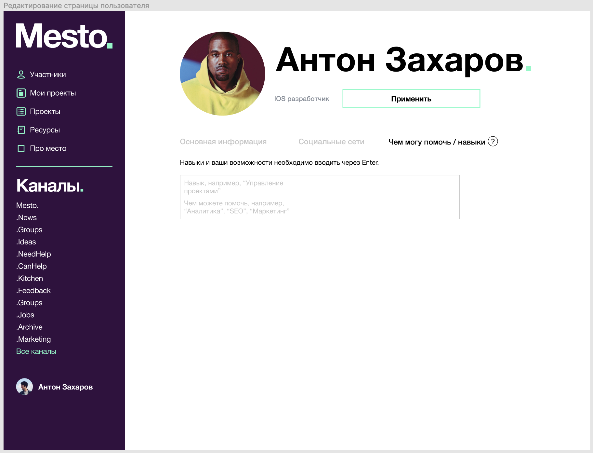
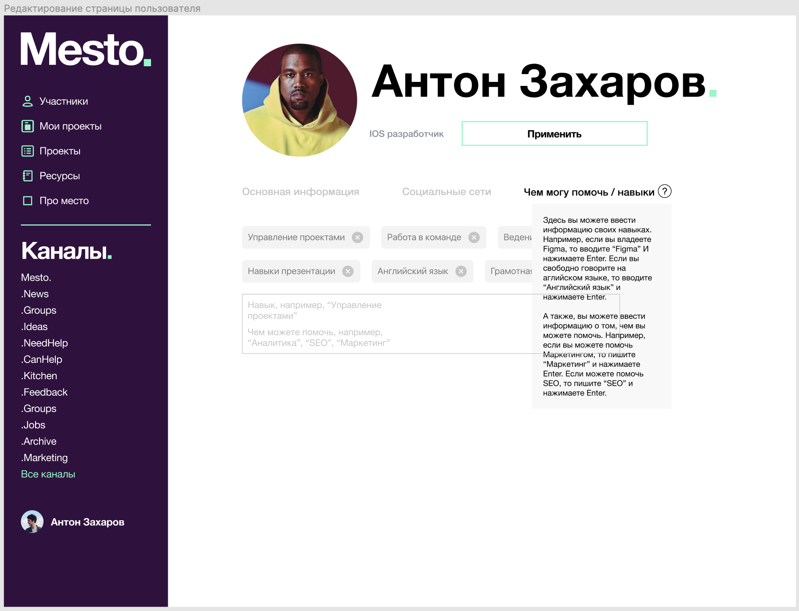

# Изменение профиля пользователя
Я, как зарегистрированный пользователь, хочу иметь возможность отредактировать свой профиль.

## Сценарий
1. Находясь на экране своего профиля пользователь нажимает на кнопку "Редактировать".
2. Открывается экран Редактирования профиля.
3. Пользователь вводит изменения в профиле. 
4. Для сохранения информации пользователь нажимает кнопку "Применить" находясь в соответсвующем разделе, где вносит изменения.
5. При изменении адреса происходит [вызов справочника стран и городов](../../ApiDoc/User/location.md). Из ответа берется страна и город.
6. Для соохранения профиля пользователя происходит [запрос на изменение профиля пользователя](../../ApiDoc/User/UpdateUser.md)
7. Для сохранения автарки необходимо [вызвать сервис загрузки изображения](../../ApiDoc/User/UploadImage.md)
8. Пользователь может [добавить контакт](../../ApiDoc/Contact/CreateContact.md), [Изменить контакт](../../ApiDoc/Contact/UpdateContact.md), [Удалить контакт](../../ApiDoc/Contact/DeleteContact.md)
9. После сохранения всех данных пользователь переходит на экран просмотра своего профиля

# Экранные формы

